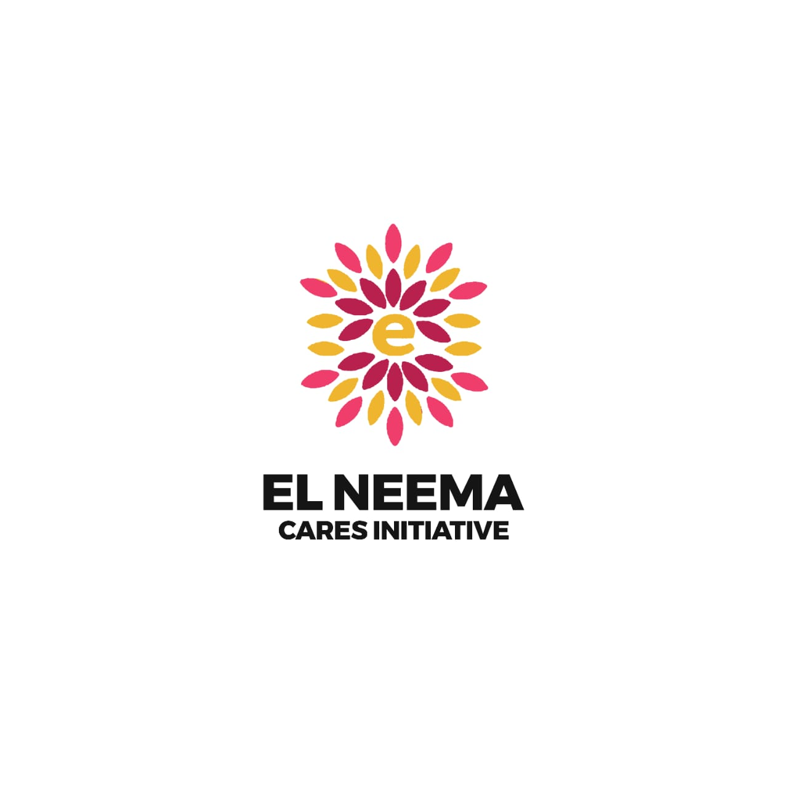
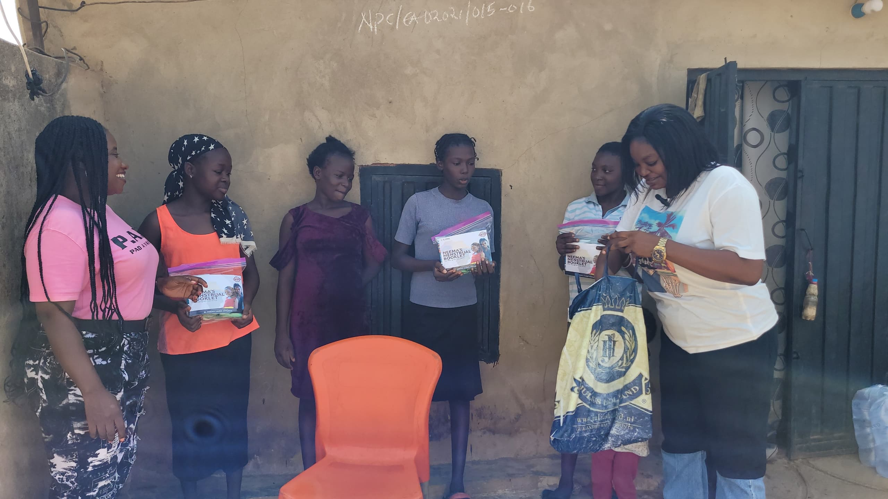
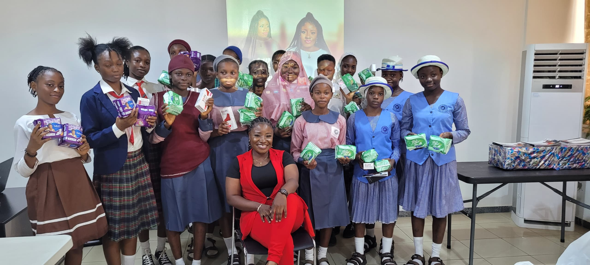
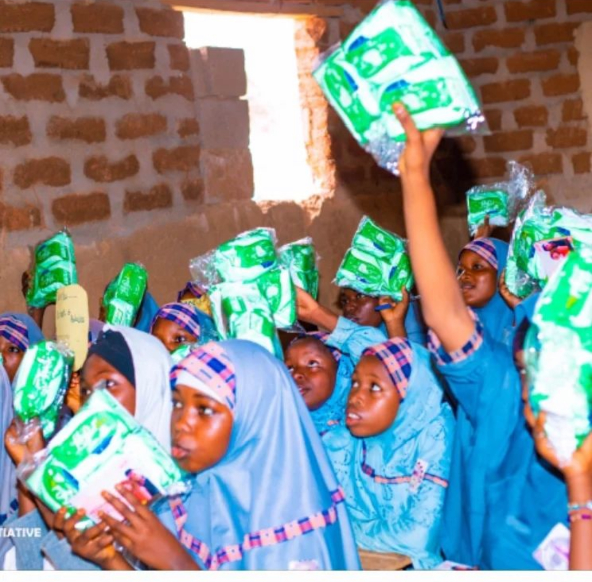

## El-Neema
El-Neema is humanitarian service + Education platform  that reaches out to individuals through community outreaches gifting them with whatever they deem fit that they need as it’s in their capacity.

They also promote social change and are committed to ending period poverty and period stigmatization through the education of young girls on menstrual hygiene and then gifting them sanitary towels.

## Photos

